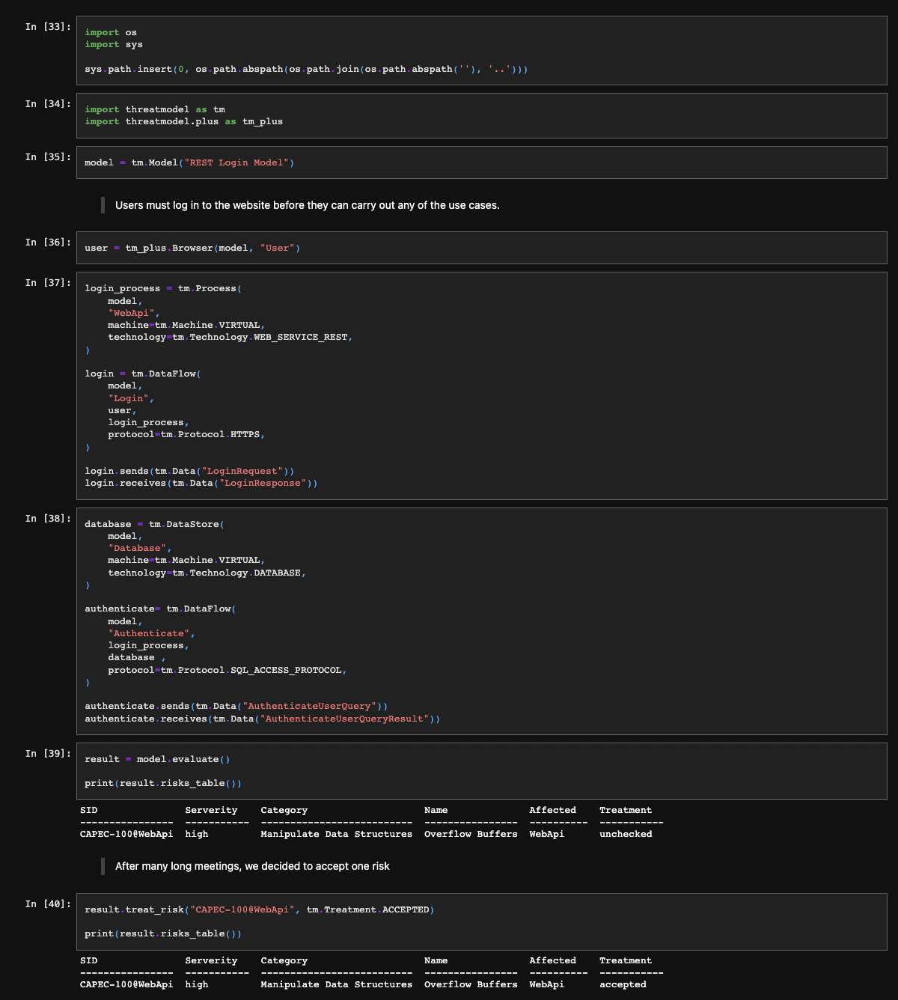

# threatmodel
> Threatmodeling as Code

## Install
```bash
pip install threatmodel
```

## How to use
```bash
python3 threatmodel.py
```

```python
#!/usr/bin/env python3

# threatmodel.py

import threatmodel as tm

model = tm.Model("Demo Model")

pii = tm.Data("PII")

server = tm.Process(
    model,
    "Server",
    machine=tm.Machine.VIRTUAL,
    technology=tm.Technology.WEB_SERVER,
    environment_variables=True,
)

server.processes(pii)

database = tm.DataStore(
    model,
    "Database",
    machine=tm.Machine.VIRTUAL,
    technology=tm.Technology.DATABASE,
    environment_variables=False,
)

database.stores(pii)

crud = tm.DataFlow(
    model,
    "CRUD",
    server,
    database,
    protocol=tm.Protocol.SQL_ACCESS_PROTOCOL
)

crud.sends(pii)
crud.receives(pii)

result = model.evaluate()

print(result.risks_table(table_format=tm.TableFormat.GITHUB))
```
Output:
| ID               | Serverity   | Name                                      | Affected   | Mitigation   |
|------------------|-------------|-------------------------------------------|------------|--------------|
| CAPEC-10@Server  | high        | Buffer Overflow via Environment Variables | Server     | none         |
| CAPEC-100@Server | high        | Overflow Buffers                          | Server     | none         |
|...|...|...|...|...|

## Jupyter Threatbook
> Threatmodeling with jupyter notebooks



## Examples

See more complete [examples](https://github.com/hupe1980/threatmodel/tree/master/examples).

## Other related projects
- [pytm](https://github.com/izar/pytm) - A Pythonic framework for threat modeling
- [threagile](https://github.com/Threagile/threagile) - Agile Threat Modeling Toolkit

## License

[MIT](LICENSE)