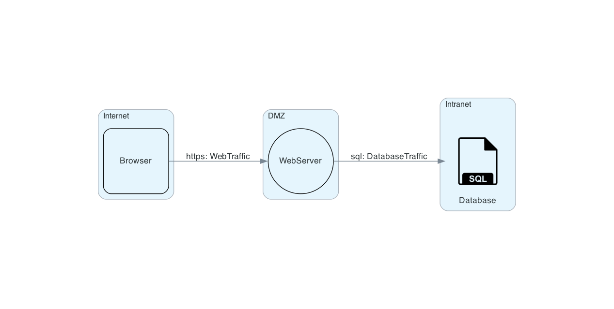

# Demo Model
> Sample description

## Data-Flow Diagram

## Potential Risks
|ID|Category|Risk|
|---|---|---|
|[CAPEC-62@WebServer@WebTraffic](#capec-62webserverwebtraffic)|Subvert Access Control|Cross-Site Request Forgery (CSRF) risk at WebServer via WebTraffic from Browser|
|[CAPEC-63@WebServer](#capec-63webserver)|Inject Unexpected Items|Cross-Site Scripting (XSS) risk at WebServer|
|[CAPEC-66@WebServer@DatabaseTraffic](#capec-66webserverdatabasetraffic)|Inject Unexpected Items|SQL Injection risk at WebServer against database Database via DatabaseTraffic|

## User Stories
|ID|Category|User Story|
|---|---|---|
|[ASVS-3.7.1@CAPEC-62@WebServer@WebTraffic](#asvs-371capec-62webserverwebtraffic)|Defenses Against Session Management Exploits|Verify the application ensures a full, valid login session or requires re-authentication or secondary verification before allowing any sensitive transactions or account modifications.|
|[ASVS-4.3.3@CAPEC-62@WebServer@WebTraffic](#asvs-433capec-62webserverwebtraffic)|Other Access Control Considerations|Verify the application has additional authorization (such as step up or adaptive authentication) for lower value systems, and / or segregation of duties for high value applications to enforce anti-fraud controls as per the risk of application and past fraud.|
|[ASVS-5.1.4@CAPEC-63@WebServer](#asvs-514capec-63webserver)|Input Validation|Verify that structured data is strongly typed and validated against a defined schema including allowed characters, length and pattern (e.g. credit card numbers, e-mail addresses, telephone numbers, or validating that two related fields are reasonable, such as checking that suburb and zip/postcode match).|
|[ASVS-1.2.2@CAPEC-62@WebServer@WebTraffic](#asvs-122capec-62webserverwebtraffic)|Authentication Architecture|Verify that communications between application components, including APIs, middleware and data layers, are authenticated. Components should have the least necessary privileges needed.|
|[ASVS-5.1.3@CAPEC-63@WebServer](#asvs-513capec-63webserver)|Input Validation|Verify that all input (HTML form fields, REST requests, URL parameters, HTTP headers, cookies, batch files, RSS feeds, etc) is validated using positive validation (allow lists).|
|[ASVS-5.3.4@CAPEC-66@WebServer@DatabaseTraffic](#asvs-534capec-66webserverdatabasetraffic)|Output Encoding and Injection Prevention|Verify that data selection or database queries (e.g. SQL, HQL, ORM, NoSQL) use parameterized queries, ORMs, entity frameworks, or are otherwise protected from database injection attacks.|
|[ASVS-14.5.4@CAPEC-62@WebServer@WebTraffic](#asvs-1454capec-62webserverwebtraffic)|HTTP Request Header Validation|Verify that HTTP headers added by a trusted proxy or SSO devices, such as a bearer token, are authenticated by the application.|
|[ASVS-13.2.3@CAPEC-62@WebServer@WebTraffic](#asvs-1323capec-62webserverwebtraffic)|RESTful Web Service|Verify that RESTful web services that utilize cookies are protected from Cross-Site Request Forgery via the use of at least one or more of the following: double submit cookie pattern, CSRF nonces, or Origin request header checks.|
|[ASVS-5.3.3@CAPEC-63@WebServer](#asvs-533capec-63webserver)|Output Encoding and Injection Prevention|Verify that context-aware, preferably automated - or at worst, manual - output escaping protects against reflected, stored, and DOM based XSS.|
|[ASVS-5.3.5@CAPEC-66@WebServer@DatabaseTraffic](#asvs-535capec-66webserverdatabasetraffic)|Output Encoding and Injection Prevention|Verify that where parameterized or safer mechanisms are not present, context-specific output encoding is used to protect against injection attacks, such as the use of SQL escaping to protect against SQL injection.|
|[ASVS-3.4.3@CAPEC-62@WebServer@WebTraffic](#asvs-343capec-62webserverwebtraffic)|Cookie-based Session Management|Verify that cookie-based session tokens utilize the 'SameSite' attribute to limit exposure to cross-site request forgery attacks.|
|[ASVS-1.2.4@CAPEC-62@WebServer@WebTraffic](#asvs-124capec-62webserverwebtraffic)|Authentication Architecture|Verify that all authentication pathways and identity management APIs implement consistent authentication security control strength, such that there are no weaker alternatives per the risk of the application.|
|[ASVS-4.2.2@CAPEC-62@WebServer@WebTraffic](#asvs-422capec-62webserverwebtraffic)|Operation Level Access Control|Verify that the application or framework enforces a strong anti-CSRF mechanism to protect authenticated functionality, and effective anti-automation or anti-CSRF protects unauthenticated functionality.|
|[ASVS-1.2.3@CAPEC-62@WebServer@WebTraffic](#asvs-123capec-62webserverwebtraffic)|Authentication Architecture|Verify that the application uses a single vetted authentication mechanism that is known to be secure, can be extended to include strong authentication, and has sufficient logging and monitoring to detect account abuse or breaches.|

## Risk Details
### CAPEC-62@WebServer@WebTraffic
An attacker crafts malicious web links and distributes them (via web pages, email, etc.), typically in a targeted manner, hoping to induce users to click on the link and execute the malicious action against some third-party application. If successful, the action embedded in the malicious link will be processed and accepted by the targeted application with the users' privilege level. This type of attack leverages the persistence and implicit trust placed in user session cookies by many web applications today. In such an architecture, once the user authenticates to an application and a session cookie is created on the user's system, all following transactions for that session are authenticated using that cookie including potential actions initiated by an attacker and simply 'riding' the existing session cookie.

**Prerequisites**:

**Risk**:\
⚠ Cross-Site Request Forgery (CSRF) risk at WebServer via WebTraffic from Browser

**Mitigations**:
- Set "samesite" attribute for cookie-based session tokens: [ASVS-3.4.3@CAPEC-62@WebServer@WebTraffic](#asvs-343capec-62webserverwebtraffic)
- Use centralized authentication mechanism: [ASVS-1.2.3@CAPEC-62@WebServer@WebTraffic](#asvs-123capec-62webserverwebtraffic)
- Re-authenticate before sensitive transactions: [ASVS-3.7.1@CAPEC-62@WebServer@WebTraffic](#asvs-371capec-62webserverwebtraffic)
- Add CSRF protection for cookie based REST services: [ASVS-13.2.3@CAPEC-62@WebServer@WebTraffic](#asvs-1323capec-62webserverwebtraffic)
- Mutually authenticate application components. Minimize privileges: [ASVS-1.2.2@CAPEC-62@WebServer@WebTraffic](#asvs-122capec-62webserverwebtraffic)
- Enforce additional authorization and segregation of duties: [ASVS-4.3.3@CAPEC-62@WebServer@WebTraffic](#asvs-433capec-62webserverwebtraffic)
- Consistently apply authentication strength: [ASVS-1.2.4@CAPEC-62@WebServer@WebTraffic](#asvs-124capec-62webserverwebtraffic)
- Use CSRF protection against authenticated functionality, add anti-automation controls for unauthenticated functionality: [ASVS-4.2.2@CAPEC-62@WebServer@WebTraffic](#asvs-422capec-62webserverwebtraffic)
- Authenticate HTTP headers added by a trusted proxy or SSO device: [ASVS-14.5.4@CAPEC-62@WebServer@WebTraffic](#asvs-1454capec-62webserverwebtraffic)

**References**:
- https://capec.mitre.org/data/definitions/62.html
- https://cwe.mitre.org/data/definitions/352.html
- https://cwe.mitre.org/data/definitions/306.html
- https://cwe.mitre.org/data/definitions/664.html
- https://cwe.mitre.org/data/definitions/732.html
- https://cwe.mitre.org/data/definitions/1275.html

---
### CAPEC-63@WebServer
An adversary embeds malicious scripts in content that will be served to web browsers. The goal of the attack is for the target software, the client-side browser, to execute the script with the users' privilege level. An attack of this type exploits a programs' vulnerabilities that are brought on by allowing remote hosts to execute code and scripts. Web browsers, for example, have some simple security controls in place, but if a remote attacker is allowed to execute scripts (through injecting them in to user-generated content like bulletin boards) then these controls may be bypassed. Further, these attacks are very difficult for an end user to detect.

**Prerequisites**:
- Target client software must be a client that allows scripting communication from remote hosts, such as a JavaScript-enabled Web Browser.

**Risk**:\
⚠ Cross-Site Scripting (XSS) risk at WebServer

**Mitigations**:
- Whitelist all external (HTTP) input: [ASVS-5.1.3@CAPEC-63@WebServer](#asvs-513capec-63webserver)
- Escape output against XSS: [ASVS-5.3.3@CAPEC-63@WebServer](#asvs-533capec-63webserver)
- Enforce schema on type/contents of structured data: [ASVS-5.1.4@CAPEC-63@WebServer](#asvs-514capec-63webserver)

**References**:
- https://capec.mitre.org/data/definitions/63.html
- https://cwe.mitre.org/data/definitions/79.html
- https://cwe.mitre.org/data/definitions/20.html

---
### CAPEC-66@WebServer@DatabaseTraffic
This attack exploits target software that constructs SQL statements based on user input. An attacker crafts input strings so that when the target software constructs SQL statements based on the input, the resulting SQL statement performs actions other than those the application intended. SQL Injection results from failure of the application to appropriately validate input.

**Prerequisites**:
- SQL queries used by the application to store, retrieve or modify data.
- User-controllable input that is not properly validated by the application as part of SQL queries.

**Risk**:\
⚠ SQL Injection risk at WebServer against database Database via DatabaseTraffic

**Mitigations**:
- Lock/precompile queries (parameterization) to avoid injection attacks: [ASVS-5.3.4@CAPEC-66@WebServer@DatabaseTraffic](#asvs-534capec-66webserverdatabasetraffic)
- Encode output context-specifically: [ASVS-5.3.5@CAPEC-66@WebServer@DatabaseTraffic](#asvs-535capec-66webserverdatabasetraffic)

**References**:
- https://capec.mitre.org/data/definitions/66.html
- https://cwe.mitre.org/data/definitions/89.html
- https://cwe.mitre.org/data/definitions/1286.html

---

## User Story Details
### ASVS-3.7.1@CAPEC-62@WebServer@WebTraffic
Verify the application ensures a full, valid login session or requires re-authentication or secondary verification before allowing any sensitive transactions or account modifications.

**Feature Name**: Re-authenticate before sensitive transactions

**User Story**:\
Verify the application ensures a full, valid login session or requires re-authentication or secondary verification before allowing any sensitive transactions or account modifications.

**References**:
- https://owasp.org/www-project-web-security-testing-guide/v41/4-Web_Application_Security_Testing/06-Session_Management_Testing/01-Testing_for_Session_Management_Schema.html#gray-box-testing-and-example
- https://cheatsheetseries.owasp.org/cheatsheets/Session_Management_Cheat_Sheet.html
- https://cheatsheetseries.owasp.org/cheatsheets/Transaction_Authorization_Cheat_Sheet.html
- https://cwe.mitre.org/data/definitions/306.html

---
### ASVS-13.2.3@CAPEC-62@WebServer@WebTraffic
Verify that RESTful web services that utilize cookies are protected from Cross-Site Request Forgery via the use of at least one or more of the following: double submit cookie pattern, CSRF nonces, or Origin request header checks.

**Feature Name**: Add CSRF protection for cookie based REST services

**User Story**:\
Verify that RESTful web services that utilize cookies are protected from Cross-Site Request Forgery via the use of at least one or more of the following: double submit cookie pattern, CSRF nonces, or Origin request header checks.

**References**:
- https://owasp.org/www-project-web-security-testing-guide/v41/4-Web_Application_Security_Testing/06-Session_Management_Testing/05-Testing_for_Cross_Site_Request_Forgery.html
- https://cheatsheetseries.owasp.org/cheatsheets/REST_Assessment_Cheat_Sheet.html
- https://cheatsheetseries.owasp.org/cheatsheets/REST_Security_Cheat_Sheet.html
- https://cheatsheetseries.owasp.org/cheatsheets/Cross-Site_Request_Forgery_Prevention_Cheat_Sheet.html
- https://cwe.mitre.org/data/definitions/352.html

---
### ASVS-1.2.4@CAPEC-62@WebServer@WebTraffic
Verify that all authentication pathways and identity management APIs implement consistent authentication security control strength, such that there are no weaker alternatives per the risk of the application.

**Feature Name**: Consistently apply authentication strength

**User Story**:\
Verify that all authentication pathways and identity management APIs implement consistent authentication security control strength, such that there are no weaker alternatives per the risk of the application.

**References**:
- https://cwe.mitre.org/data/definitions/306.html

---
### ASVS-1.2.3@CAPEC-62@WebServer@WebTraffic
Verify that the application uses a single vetted authentication mechanism that is known to be secure, can be extended to include strong authentication, and has sufficient logging and monitoring to detect account abuse or breaches.

**Feature Name**: Use centralized authentication mechanism

**User Story**:\
Verify that the application uses a single vetted authentication mechanism that is known to be secure, can be extended to include strong authentication, and has sufficient logging and monitoring to detect account abuse or breaches.

**References**:
- https://cwe.mitre.org/data/definitions/306.html

---
### ASVS-5.3.5@CAPEC-66@WebServer@DatabaseTraffic
Verify that where parameterized or safer mechanisms are not present, context-specific output encoding is used to protect against injection attacks, such as the use of SQL escaping to protect against SQL injection.

**Feature Name**: Encode output context-specifically

**User Story**:\
Verify that where parameterized or safer mechanisms are not present, context-specific output encoding is used to protect against injection attacks, such as the use of SQL escaping to protect against SQL injection.

**References**:
- https://owasp.org/www-project-web-security-testing-guide/v41/4-Web_Application_Security_Testing/07-Input_Validation_Testing/05-Testing_for_SQL_Injection.html
- https://cwe.mitre.org/data/definitions/89.html

---
### ASVS-5.1.3@CAPEC-63@WebServer
Verify that all input (HTML form fields, REST requests, URL parameters, HTTP headers, cookies, batch files, RSS feeds, etc) is validated using positive validation (allow lists).

**Feature Name**: Whitelist all external (HTTP) input

**User Story**:\
Verify that all input (HTML form fields, REST requests, URL parameters, HTTP headers, cookies, batch files, RSS feeds, etc) is validated using positive validation (allow lists).

**References**:
- https://owasp-top-10-proactive-controls-2018.readthedocs.io/en/latest/c5-validate-all-inputs.html
- https://owasp.org/www-project-web-security-testing-guide/v41/4-Web_Application_Security_Testing/07-Input_Validation_Testing/
- https://cheatsheetseries.owasp.org/cheatsheets/Mass_Assignment_Cheat_Sheet.html
- https://cheatsheetseries.owasp.org/cheatsheets/Input_Validation_Cheat_Sheet.html
- https://cwe.mitre.org/data/definitions/20.html

---
### ASVS-5.3.3@CAPEC-63@WebServer
Verify that context-aware, preferably automated - or at worst, manual - output escaping protects against reflected, stored, and DOM based XSS.

**Feature Name**: Escape output against XSS

**User Story**:\
Verify that context-aware, preferably automated - or at worst, manual - output escaping protects against reflected, stored, and DOM based XSS.

**References**:
- https://owasp-top-10-proactive-controls-2018.readthedocs.io/en/latest/c4-encode-escape-data.html
- https://owasp.org/www-project-web-security-testing-guide/v41/4-Web_Application_Security_Testing/07-Input_Validation_Testing/01-Testing_for_Reflected_Cross_Site_Scripting.html
- https://cheatsheetseries.owasp.org/cheatsheets/Cross_Site_Scripting_Prevention_Cheat_Sheet.html
- https://cwe.mitre.org/data/definitions/79.html

---
### ASVS-5.1.4@CAPEC-63@WebServer
Verify that structured data is strongly typed and validated against a defined schema including allowed characters, length and pattern (e.g. credit card numbers, e-mail addresses, telephone numbers, or validating that two related fields are reasonable, such as checking that suburb and zip/postcode match).

**Feature Name**: Enforce schema on type/contents of structured data

**User Story**:\
Verify that structured data is strongly typed and validated against a defined schema including allowed characters, length and pattern (e.g. credit card numbers, e-mail addresses, telephone numbers, or validating that two related fields are reasonable, such as checking that suburb and zip/postcode match).

**References**:
- https://owasp-top-10-proactive-controls-2018.readthedocs.io/en/latest/c5-validate-all-inputs.html
- https://owasp.org/www-project-web-security-testing-guide/v41/4-Web_Application_Security_Testing/07-Input_Validation_Testing/
- https://cheatsheetseries.owasp.org/cheatsheets/Mass_Assignment_Cheat_Sheet.html
- https://cheatsheetseries.owasp.org/cheatsheets/Input_Validation_Cheat_Sheet.html
- https://cwe.mitre.org/data/definitions/20.html

---
### ASVS-5.3.4@CAPEC-66@WebServer@DatabaseTraffic
Verify that data selection or database queries (e.g. SQL, HQL, ORM, NoSQL) use parameterized queries, ORMs, entity frameworks, or are otherwise protected from database injection attacks.

**Feature Name**: Lock/precompile queries (parameterization) to avoid injection attacks

**User Story**:\
Verify that data selection or database queries (e.g. SQL, HQL, ORM, NoSQL) use parameterized queries, ORMs, entity frameworks, or are otherwise protected from database injection attacks.

**References**:
- https://owasp-top-10-proactive-controls-2018.readthedocs.io/en/latest/c3-secure-database-access.html
- https://owasp.org/www-project-web-security-testing-guide/v41/4-Web_Application_Security_Testing/07-Input_Validation_Testing/05-Testing_for_SQL_Injection.html
- https://cheatsheetseries.owasp.org/cheatsheets/Query_Parameterization_Cheat_Sheet.html
- https://cwe.mitre.org/data/definitions/89.html

---
### ASVS-4.2.2@CAPEC-62@WebServer@WebTraffic
Verify that the application or framework enforces a strong anti-CSRF mechanism to protect authenticated functionality, and effective anti-automation or anti-CSRF protects unauthenticated functionality.

**Feature Name**: Use CSRF protection against authenticated functionality, add anti-automation controls for unauthenticated functionality

**User Story**:\
Verify that the application or framework enforces a strong anti-CSRF mechanism to protect authenticated functionality, and effective anti-automation or anti-CSRF protects unauthenticated functionality.

**References**:
- https://owasp.org/www-project-web-security-testing-guide/v41/4-Web_Application_Security_Testing/06-Session_Management_Testing/05-Testing_for_Cross_Site_Request_Forgery.html
- https://cheatsheetseries.owasp.org/cheatsheets/Insecure_Direct_Object_Reference_Prevention_Cheat_Sheet.html
- https://cheatsheetseries.owasp.org/cheatsheets/Cross-Site_Request_Forgery_Prevention_Cheat_Sheet.html
- https://cheatsheetseries.owasp.org/cheatsheets/Authorization_Testing_Automation_Cheat_Sheet.html
- https://cwe.mitre.org/data/definitions/352.html

---
### ASVS-14.5.4@CAPEC-62@WebServer@WebTraffic
Verify that HTTP headers added by a trusted proxy or SSO devices, such as a bearer token, are authenticated by the application.

**Feature Name**: Authenticate HTTP headers added by a trusted proxy or SSO device

**User Story**:\
Verify that HTTP headers added by a trusted proxy or SSO devices, such as a bearer token, are authenticated by the application.

**References**:
- https://cwe.mitre.org/data/definitions/306.html

---
### ASVS-4.3.3@CAPEC-62@WebServer@WebTraffic
Verify the application has additional authorization (such as step up or adaptive authentication) for lower value systems, and / or segregation of duties for high value applications to enforce anti-fraud controls as per the risk of application and past fraud.

**Feature Name**: Enforce additional authorization and segregation of duties

**User Story**:\
Verify the application has additional authorization (such as step up or adaptive authentication) for lower value systems, and / or segregation of duties for high value applications to enforce anti-fraud controls as per the risk of application and past fraud.

**References**:
- https://cheatsheetseries.owasp.org/cheatsheets/REST_Assessment_Cheat_Sheet.html
- https://cwe.mitre.org/data/definitions/732.html

---
### ASVS-3.4.3@CAPEC-62@WebServer@WebTraffic
Verify that cookie-based session tokens utilize the 'SameSite' attribute to limit exposure to cross-site request forgery attacks.

**Feature Name**: Set "samesite" attribute for cookie-based session tokens

**User Story**:\
Verify that cookie-based session tokens utilize the 'SameSite' attribute to limit exposure to cross-site request forgery attacks.

**References**:
- https://owasp-top-10-proactive-controls-2018.readthedocs.io/en/latest/c6-implement-digital-identity.html
- https://owasp.org/www-project-web-security-testing-guide/v41/4-Web_Application_Security_Testing/06-Session_Management_Testing/02-Testing_for_Cookies_Attributes.html#httponly-attribute
- https://cheatsheetseries.owasp.org/cheatsheets/Session_Management_Cheat_Sheet.html
- https://cheatsheetseries.owasp.org/cheatsheets/Cross-Site_Request_Forgery_Prevention_Cheat_Sheet.html
- https://cwe.mitre.org/data/definitions/1275.html

---
### ASVS-1.2.2@CAPEC-62@WebServer@WebTraffic
Verify that communications between application components, including APIs, middleware and data layers, are authenticated. Components should have the least necessary privileges needed.

**Feature Name**: Mutually authenticate application components. Minimize privileges

**User Story**:\
Verify that communications between application components, including APIs, middleware and data layers, are authenticated. Components should have the least necessary privileges needed.

**References**:
- https://owasp-top-10-proactive-controls-2018.readthedocs.io/en/latest/c3-secure-database-access.html
- https://cwe.mitre.org/data/definitions/306.html

---
